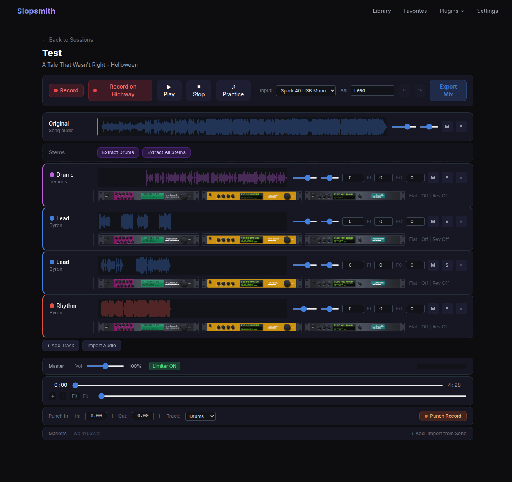

# Slopsmith Studio Plugin

A collaborative band recording and mixing plugin for [Slopsmith](https://github.com/byrongamatos/slopsmith). Record individual parts against a song, layer takes, mix with per-track effects, and export a final mix.



## Features

### Recording

- **Record on Highway** — record your guitar/bass while playing along with the Slopsmith note highway. The recording overlay shows input level metering, and you control playback with the highway's own transport. Pre-play silence is automatically trimmed and clock drift is corrected server-side.
- **Record in Mixer** — record directly within the mixer view with Web Audio API playback of all tracks.
- **Punch-in Recording** — set in/out points on the timeline, then re-record just that section. The new performance is spliced into the existing track, preserving everything before and after.
- **Input Gain** — adjustable input level (0-300%) applied server-side via ffmpeg so the raw mic stream stays drift-free.
- **Automatic Drift Correction** — the server compares the recording duration against the song's playback clock and applies tempo correction for drift >0.05%.

### Tracks & Channels

- **Custom Channels** — add unlimited independent tracks with custom names. Not limited to Lead/Rhythm/Bass — create "Lead Double", "Rhythm L", "Rhythm R", "Acoustic Layer", etc.
- **Audio Import** — import WAV/MP3/OGG files into any track. Drag and drop or browse. Useful for vocals recorded on a phone, keyboard parts from another DAW, etc.
- **Inline Rename** — double-click any track name to rename it.
- **Track Color Coding** — each track has a color (auto-assigned by instrument type, or pick from a 24-color palette). Colors tint the waveform and show as a left border.
- **Multiple Takes** — record as many takes as you want per track. Each is independent with its own mix settings.

### Mixing

#### Per-Track Controls
- **Volume** (0-150%) and **Pan** (-100 to +100)
- **Mute** and **Solo** toggles
- **Time Offset** (ms) — shift a track forward or backward to fine-tune sync
- **Fade In / Fade Out** (ms) — smooth volume ramps at track edges, visualized as gradient overlays on the waveform

#### Per-Track Effects (Gear Rack UI)
Each track has three effects rendered as clickable Rocksmith gear rack unit images. Click to open a popup with interactive SVG rotary knobs.

- **Parametric EQ** — 3-band: Low shelf (200Hz), Mid peak (1kHz), High shelf (4kHz). Range: -12dB to +12dB per band.
- **Compressor** — Threshold (-60 to 0dB), Ratio (1:1 to 20:1), Attack (1-100ms), Release (10-1000ms). Bypassed when ratio is 1:1.
- **Reverb Send** — per-track send level (0-100%) to a shared convolution reverb bus with a generated 2-second room impulse response.

Knob interaction: drag up/down, mouse wheel for fine-tune, double-click to reset to default. All changes apply in real-time during playback.

#### Master Bus
- **Master Volume** (0-200%)
- **Master Limiter** — hard limiter at 0dBFS (toggle on/off)
- **Level Meter** — real-time peak meter (green/yellow/red)

#### Signal Chain
```
Track Source
  -> EQ (Low Shelf -> Mid Peak -> High Shelf)
  -> [Reverb Send -> Convolution Reverb -> Reverb Gain] -+
  -> Compressor                                          |
  -> Track Gain -> Pan --------------------------------->+
                                                         |
                                              Master Gain -> Limiter -> Output
```

### Timeline & Navigation

- **Waveform Display** — per-track canvas waveforms tinted with the track color, normalized to the session duration so all tracks align visually.
- **Zoom & Scroll** — zoom in/out (+/- buttons, Ctrl+scroll wheel), horizontal scroll bar, auto-scroll follows the playhead during playback.
- **Markers** — named points on the timeline (Verse, Chorus, Solo, etc.). Click to seek. Add manually or import from the song's CDLC section metadata. Shown as vertical lines on all waveforms.
- **Seek** — click anywhere on a waveform to seek, or use the transport seek bar.

### Stem Separation (Demucs)

Integrates with [slopsmith-demucs-server](https://github.com/byrongamatos/slopsmith-demucs-server) for AI-powered source separation. The demucs service runs on a desktop with GPU/RAM while Slopsmith runs on a NAS or Docker host.

- **Extract Drums** — isolate the drum track from the original song audio
- **Extract All Stems** — separate into drums, bass, vocals, and other
- Uses the `htdemucs_ft` model with `--shifts 2` for high-quality separation
- Stems are cached — subsequent extractions are instant
- Configure the Demucs server URL and API key in the settings panel

### Session Management

- **Create Session** — pick a song from your Slopsmith library, name the session
- **Session List** — all sessions with track counts and creation dates
- **Practice** — open the song on the highway to practice before recording
- **Delete** — remove a session and all its recordings

### Export

- **Server-side Mix** — all active tracks mixed with ffmpeg applying volume, pan, EQ, compressor, fades, time offsets, reverb, and master bus processing
- **Format** — MP3 (192kbps) or WAV
- **Download Link** — direct link to the exported file

### Undo/Redo

- **Ctrl+Z / Ctrl+Y** — undo and redo all mix parameter changes
- Toolbar buttons with visual state (grayed when empty)
- Debounced snapshots for slider changes, immediate capture for toggles
- Up to 50 undo steps per session

## Architecture

### Plugin Files
```
plugin.json     — plugin manifest
routes.py       — FastAPI backend (SQLite, ffmpeg processing, file management)
screen.html     — mixer and session list UI
screen.js       — Web Audio API playback, recording, waveform rendering, effects
```

### Database (SQLite)
- `studio_sessions` — session metadata, master volume/limiter settings
- `studio_tracks` — track metadata, audio file paths, custom names, colors, sort order
- `studio_mix_settings` — per-track volume, pan, mute, solo, offset, fades, EQ, compressor, reverb send
- `studio_markers` — named timeline markers

### Audio Storage
Recordings and stems are stored in `{CONFIG_DIR}/studio/{session_id}/`. Uploaded webm recordings are converted to WAV server-side for reliable duration metadata and browser compatibility.

### Dependencies
- **ffmpeg/ffprobe** — audio conversion, drift correction, gain, trimming, mix export
- **Web Audio API** — client-side playback with real-time effects (BiquadFilter, DynamicsCompressor, ConvolverNode, StereoPanner, GainNode)
- **MediaRecorder API** — browser-based audio capture

## Demucs Server Setup

The [Demucs separation service](https://github.com/byrongamatos/slopsmith-demucs-server) runs separately (e.g. on a desktop with GPU):

```bash
git clone https://github.com/byrongamatos/slopsmith-demucs-server.git
cd slopsmith-demucs-server
python -m venv .venv
.venv/bin/pip install -r requirements.txt
.venv/bin/python server.py --port 7865
```

Or install as a systemd service:
```bash
sudo cp slopsmith-demucs.service /etc/systemd/system/
sudo systemctl enable --now slopsmith-demucs
```

Configure the server URL in the Studio plugin's Demucs Settings panel.

## Installation

Copy the plugin files into your Slopsmith plugins directory:
```bash
cp -r slopsmith-plugin-studio/ path/to/slopsmith/plugins/studio/
```

Restart Slopsmith. The "Studio" entry appears in the navigation menu.
